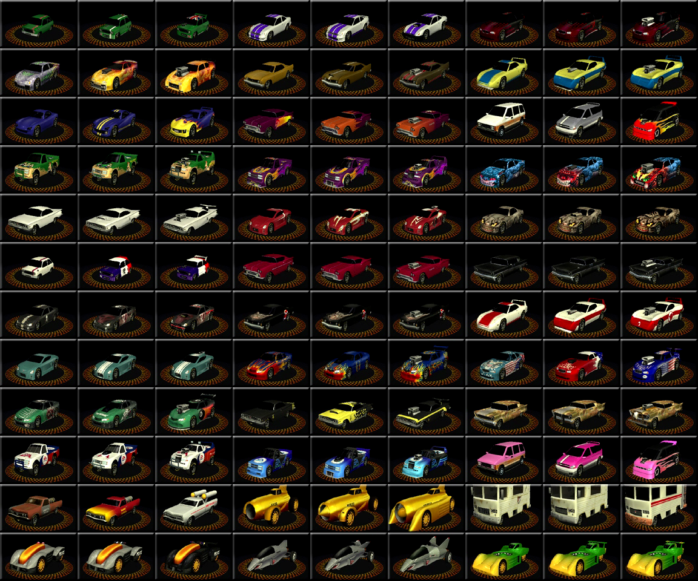

# Rumble Racing Reverse Engineering

This repository hosts my notes and tools for reverse engineering the file formats for [Rumble Racing](https://en.wikipedia.org/wiki/Rumble_Racing) (2001, PS2).

[Rumble Reader](./rumble-reader/) is a program I'm writing in Go as I work on reverse engineering the file formats. The ultimate goal is to be able to parse, export, and preserve the 3D game maps to display them in [noclip.website](https://noclip.website)

## File Formats

There are three main file types seen in the game's data: `.TRK`, `.AV`. and `.LSC`.

### `.LSC`

Stands for 'Loading Screen'.
LSC files begin with the magic `ipum` ASCII bytes.
Reading [this reddit post](https://www.reddit.com/r/ffmpeg/comments/1heju1a/help_with_rare_ipu_format/) was enough to learn that this is a stripped version of the MPEG-1 codec, and that the image can be extracted as PNGs via `ffmpeg`.

### `.TRK` and `.AV`

Probably stands for 'Track', and 'Audio/Video'.
`.TRK` files seem to contain all of the unique map data for each track, while `.AV` seems to be audio/video data. Internal map names seemed to be grouped by similarity. Internal name mappings can be seen below. Each internal map has a `.TRK`, `.AV`, and `.LSC` file. `FE` is a special case, as it seems to be globally used assets.

| Internal | Meaning           | Name            |
| -------- | ----------------- | --------------- |
| `BB1`    | Beach Blast       | Sun Burn        |
| `BB2`    | Beach Blast       | Surf And Turf   |
| `BL1`    | Bad Lands         | So Refined      |
| `BL2`    | Bad Lands         | Coal Cuts       |
| `DA1`    | Daytona           | Flip Out        |
| `DA2`    | Daytona           | The Gauntlet    |
| `DA3`    | Daytona           | Wild Kingdom    |
| `FE`     |                   | Global Data     |
| `JT1`    | Joke Tracks       | Circus Minimus  |
| `JT2`    | Joke Tracks       | Outer Limits    |
| `MA1`    | Mountain Air      | Passing Through |
| `MA2`    | Mountain Air      | Falls Down      |
| `MP1`    | Metropolis        | Touch And Go    |
| `MP2`    | Metropolis        | Car Go          |
| `SE1`    | Southern Exposure | True Grits      |
| `SE2`    | Southern Exposure | Over Easy       |

`.TRK` and `.AV` files are a special binary format created by EA games. They are seemingly optimized and aligned for compression and for quickly streaming data from disc to PS2 RAM.

It seems like these files all follow the same pattern. They are a essentially a sequential list of binary blobs, which I am calling `Chunk`s.
Each chunk consists of

1. A [FourCC](https://en.wikipedia.org/wiki/FourCC) little-endian `u32` header identifying its type.
2. Followed by a `u32` which is the size of the entire chunk
3. Followed by the chunk's data

Currently the chunks do not appear to be nested or recursive, but rather sequential.

`.TRK` files seem to have 3 distinct top-level chunks: `CTRL`, `FILL`, and `SHOC`.

- `CTRL` chunks seem to set a few variables that the program uses when reading further chunks. (needs investigation)
  - Each `.TRK` file begins with a `CTRL` chunk.
  - Each `.TRK` file has only one `CTRL` chunk.
  - Always 4 bytes of data
- `FILL` chunks are used as dummy filler data to split and align chunks data to `0x6000` boundaries.
  - Algins next chunk to `0x6000`
  - Each `FILL` chunk's data in all `.TRK` files is all zeroed out.
- `SHOC` chunks seem to store all of the important data. Each `SHOC` contains a sub-type, one of `SHDR`, `SDAT`, or `Rdat`.
  - `SHDR` (probably header data)
  - `SDAT` uncompressed, raw data
  - `Rdat` compressed data. Working on reverse engineering the compression algorithm [here](./rumble-reader/chunk/shoc/decompress.go).

Each SHOC entry contains some data which makes up a game asset.
I am currently working through understanding how `SHOC`s are related to each other, and how to pull out this data.
The game asset FourCC types are listed here as follows, along with the address of the function that processes this data:

| FourCC | Game Asset Purpose                                     | Parsing Function               |
| ------ | ------------------------------------------------------ | ------------------------------ |
| `ico`  |                                                        | FUN_001a7560                   |
| `TxtR` | Text/String List                                       | FUN_001a73e0                   |
| `RleD` |                                                        | FUN_001a7370                   |
| `Mclc` |                                                        | FUN_001a7330                   |
| `Gimg` | General(?) Image, variable size (IPU format)           | FUN_001a72f0                   |
| `CarI` | Car Image, 128 × 80 (IPU format)                       | FUN_001a7310                   |
| `Cimg` | Cup Image, 128 × 96 (IPU format)                       | FUN_001a72d0                   |
| `Timg` | Track Image, 128 × 80 (IPU format)                     | FUN_001a72b0                   |
| `Limg` |                                                        | FUN_001a7290                   |
| `Mask` |                                                        | FUN_001a7270                   |
| `Bimg` | Background Image, 512x448 (IPU format)                 | FUN_001a7250                   |
| `txf2` |                                                        | FUN_001a7340                   |
| `Cvkb` |                                                        | FUN_001abb80                   |
| `Cvkh` |                                                        | FUN_001abb80                   |
| `Cshd` |                                                        | FUN_001abb80                   |
| `Ceng` |                                                        | FUN_001abb80                   |
| `Cnet` |                                                        | FUN_0017e080                   |
| `sfn`  |                                                        | FUN_0012b920                   |
| `gmd`  |                                                        | FUN_00160da0                   |
| `obf`  |                                                        | FUN_00160de0                   |
| `txf`  |                                                        | FUN_001644f0, FUN_00121230, |
| `Ctos` |                                                        | FUN_00125a10                   |
| `Cfun` |                                                        | FUN_001272e0                   |
| `Csac` |                                                        | FUN_00127550                   |
| `RPNS` |                                                        | FUN_0016c590                   |
| `Cact` |                                                        | FUN_0016c3a0                   |
| `o3da` |                                                        | FUN_0016a2a0                   |
| `o3d`  |                                                        | FUN_0016a0e0                   |
| `Cctr` |                                                        | FUN_00121230                   |
| `RLst` | Resource List, metadata about game assets in this file | thunk_FUN_00121230             |
| `rscE` |                                                        | FUN_00121230                   |
| `rscB` |                                                        | FUN_00121230                   |
|        |                                                        |                                |
