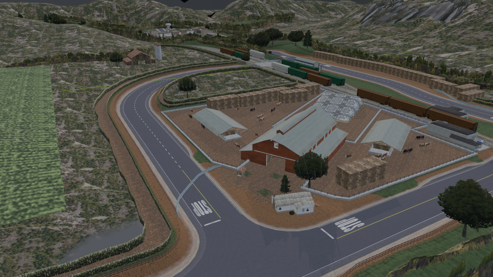
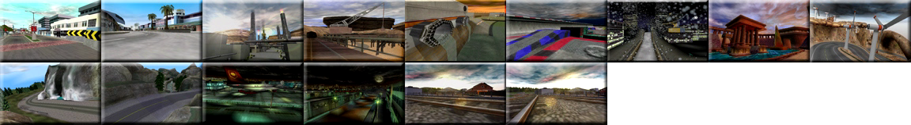

# Rumble Racing Reverse Engineering

This repository hosts my notes and tools for reverse engineering the file formats for [Rumble Racing](https://en.wikipedia.org/wiki/Rumble_Racing) (2001, PS2). [Rumble Reader](./rumble-reader/) is a program I'm writing in Go as I work on reverse engineering the file formats. The ultimate goal is to be able to parse, export, and preserve the 3D game maps to display them in [noclip.website](https://noclip.website)

*The textured mesh for the map "True Grits" in Blender*

## Main File Formats

There are three main file types seen in the game's data: `.TRK`, `.AV`. and `.LSC`.

### `.LSC`

Stands for 'Loading Screen'.
LSC files begin with the magic `ipum` ASCII bytes.
Reading [this reddit post](https://www.reddit.com/r/ffmpeg/comments/1heju1a/help_with_rare_ipu_format/) was enough to learn that this is a stripped version of the MPEG-1 codec, and that the image can be extracted as PNGs via `ffmpeg`.

### `.AV`

Stands for 'Audio/Video'.
Has a similar layout to `.TRK`, but with different top-level chunks/FourCC codes.
People have already put effort into reverse engineering this filetype, I am not the first person to look at the audio files in this game.

[vgmstream](https://github.com/vgmstream/vgmstream) contributor [bnnm](https://github.com/bnnm) added support for this filetype in [this PR](https://github.com/vgmstream/vgmstream/pull/1304).

As a result, vgmstream can read and play these files in your browser:

1. Rename the file from `.AV` to `.stream`
   - Alternatively, you can download some pre-processed files [here](https://vgm.hcs64.com/?text=rumble+racing).
2. Drop it into [vgmstream-web](https://katiefrogs.github.io/vgmstream-web/). (no 3rd party programs needed!)

### `.TRK`

Stands for 'Track'.
`.TRK` files contain all of the unique map data for each track. Internal map names seemed to be grouped by similarity. Internal name mappings can be seen below. Each internal map has a `.TRK`, `.AV`, and `.LSC` file.

| Internal | Meaning           | Name              |
| -------- | ----------------- | ----------------- |
| `BB1`    | Beach Blast       | Sun Burn          |
| `BB2`    | Beach Blast       | Surf And Turf     |
| `BL1`    | Bad Lands         | So Refined        |
| `BL2`    | Bad Lands         | Coal Cuts         |
| `DA1`    | Daytona           | Flip Out          |
| `DA2`    | Daytona           | The Gauntlet      |
| `DA3`    | Daytona           | Wild Kingdom      |
| `FE`     | Front End         | UI/Main Menu Data |
| `JT1`    | Joke Tracks       | Circus Minimus    |
| `JT2`    | Joke Tracks       | Outer Limits      |
| `MA1`    | Mountain Air      | Passing Through   |
| `MA2`    | Mountain Air      | Falls Down        |
| `MP1`    | Metropolis        | Touch And Go      |
| `MP2`    | Metropolis        | Car Go            |
| `SE1`    | Southern Exposure | True Grits        |
| `SE2`    | Southern Exposure | Over Easy         |

`.TRK` and `.AV` files are a special binary format created by EA games. They are optimized and aligned for compression and for quickly streaming data from disc to PS2 RAM.

It would be too much information for this README to write how these files are structured and how the assets are stored.
Once this project is live on noclip and I have finished that goal, I will work on writing a PDF which will document the structure and layout of these files, along with any other relevant details, so that anyone in the future who is curious about the low level details will have a good resource.

## Game Assets

The game asset FourCC types are listed here as follows, along with the address of the function that processes this data:

| Status | Meaning               |
| ------ | --------------------- |
| ❔     | Not Certain           |
| ⚠️     | Partially Extractable |
| ✅     | Extractable           |

| Type   | Status | Game Asset Type                                                                                           | Final Build Address    | Debug Build Address |
| ------ | ------ | --------------------------------------------------------------------------------------------------------- | ---------------------- | ------------------- |
| `ico`  |        | Icon                                                                                                      | 001a7560               | 001ab8e0            |
| `TxtR` | ✅     | Text/String List                                                                                          | 001a73e0               | 001ab760            |
| `RleD` |        | RLE Data                                                                                                  | 001a7370               | 001ab6f0            |
| `Mclc` |        | Memory Card Icons                                                                                         | 001a7330               | 001ab6b0            |
| `Gimg` | ✅     | General Image, variable size (IPU format)                                                                 | 001a72f0               | 001ab670            |
| `CarI` | ✅     | Car Image, 128 × 80 (IPU format)                                                                          | 001a7310               | 001ab690            |
| `Cimg` | ✅     | Cup Image, 128 × 96 (IPU format)                                                                          | 001a72d0               | 001ab650            |
| `Timg` | ✅     | Track Image, 128 × 80 (IPU format)                                                                        | 001a72b0               | 001ab630            |
| `Limg` |        | Locale Image                                                                                              | 001a7290               | 001ab610            |
| `Mask` |        | Motion Mask                                                                                               | 001a7270               | 001ab5f0            |
| `Bimg` | ✅     | Background Image, 512x448 (IPU format)                                                                    | 001a7250               | 001ab5d0            |
| `txf2` | ✅     | Texture Data (same as `txf`)                                                                              | 001a7340               | 001ab6c0            |
| `Cvkb` |        | Audio                                                                                                     | 001abb80               | 001afce0            |
| `Cvkh` |        | Audio                                                                                                     | 001abb80               | 001afce0            |
| `Cshd` |        | Audio                                                                                                     | 001abb80               | 001afce0            |
| `Ceng` |        | Audio (Engine?)                                                                                           | 001abb80               | 001afce0            |
| `Cnet` | ❔     | Network Data (paths?)                                                                                     | 0017e080               | 00183900            |
| `sfn`  |        | Font ([Arial](https://en.wikipedia.org/wiki/Arial), [Lucida](https://en.wikipedia.org/wiki/Lucida), etc.) | 0012b920               | 0012f050            |
| `gmd`  |        | Track Data                                                                                                | 00160da0               | 00162ca0            |
| `Obf`  | ✅      | Track Mesh                                                                                                | 00160de0               | 00162ce0            |
| `txf`  | ✅     | Texture / Texture Group Data                                                                              | 001644f0, 00121230, | 001667c0            |
| `Ctos` | ❔     | Voice-over Group Data?                                                                                    | 00125a10               | 00129160            |
| `Cfun` | ❔     | CtrlFct (Control Function?)                                                                               | 001272e0               | 0012a9a0            |
| `Csac` | ❔     | SupAct (actor system?)                                                                                    | 00127550               | 0012ac10            |
| `RPNS` | ❔     | RPNstrings                                                                                                | 0016c590               | 0016ee90            |
| `Cact` | ✅     | Game Actor instance                                                                                       | 0016c3a0               | 0016ec60            |
| `o3da` |        | Object3D Data Array                                                                                       | 0016a2a0               | 0016cb40            |
| `o3d`  | ✅      | Object3D Data                                                                                             | 0016a0e0               | 0016c950            |
| `Cctr` | ❔     | Game Status Control?                                                                                      | 00121230               | 00128504            |
| `RLst` | ✅     | Record Debug Resources List                                                                               | 00121230               | 00126c60            |
| `rscE` | ❔     |                                                                                                           | 00121230               | 001284c4            |
| `rscB` | ❔     |                                                                                                           | 00121230               | 001284ac            |
